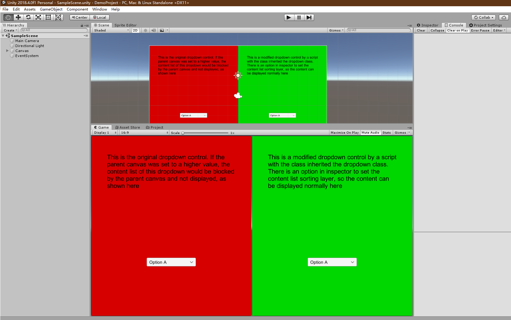
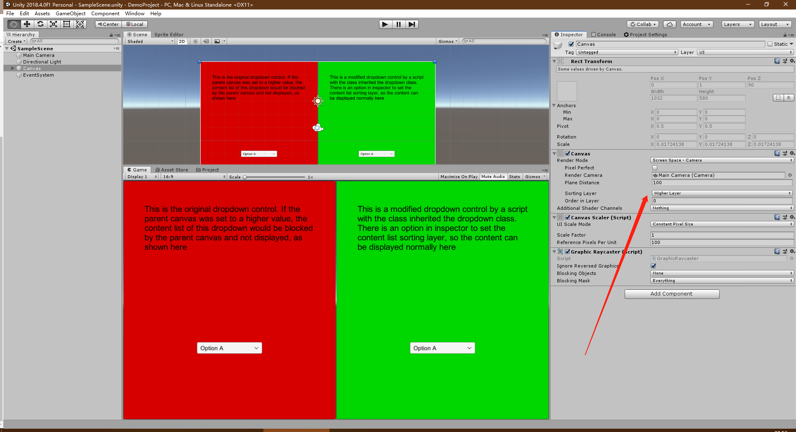
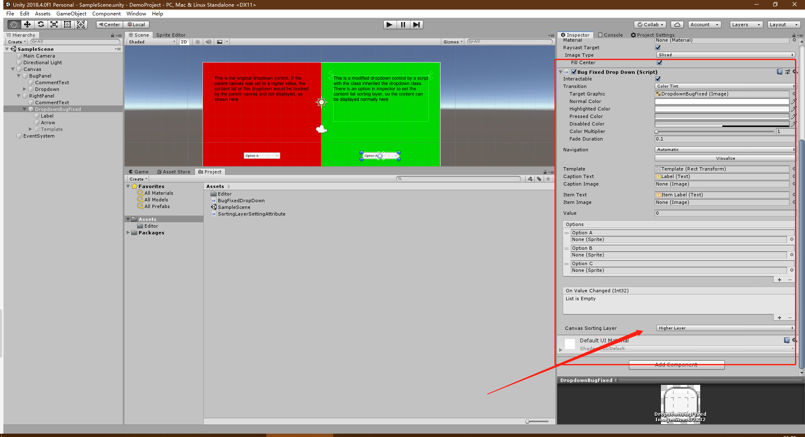
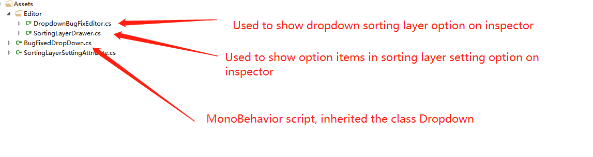

# 1174376  The bug about the UGUI dropdown runtime template's canvas sorting layer

[Click here to back to root readme file](../../Readme.md)

## Bug description

The bug about the UGUI dropdown runtime template's canvas sorting layer

1. The dropdown will automatically create a canvas for the dropdown list background, but the sorting layer of the canvas is default and cannot be changed. I have to inherit the Dropdown class and fix this bug by making the sorting layer can be set in the inspector

2. Please make the dropdown's list canvas sorting layer can be set in the inspector, because we need to set dropdowns to different UI layers
   
Version 2018.4.0f1_b6ffa8986c8d
Computer Intel(R) Core(TM) i5-4590 CPU @ 3.30GHz; NVIDIA GeForce GT 740 NVIDIA GeForce GT

## Project instruction

I made a simple project in the directory ["DemoProject"](./DemoProject), you just need to open this project and you will see some explanation text, like this:  
  
Click on the two dropdowns for comparison. The one on right side cannot be displayed normally, the one on left side cannot.  
The sorting layer of the UI canvas has been set to a higher value:  
  
The dropdown control on the right panel uses a modified component script:  
  
  
